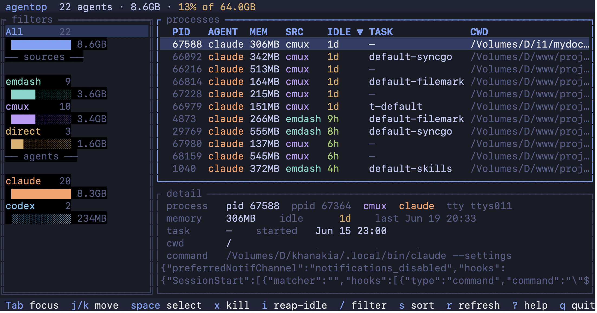
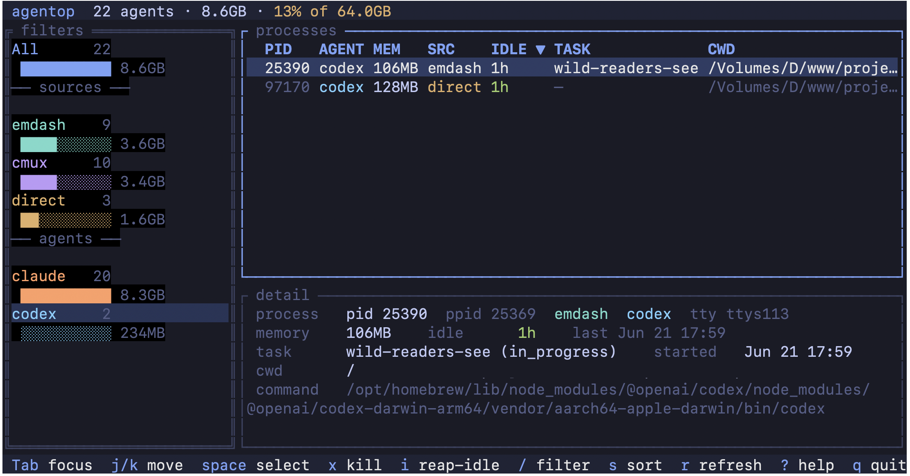
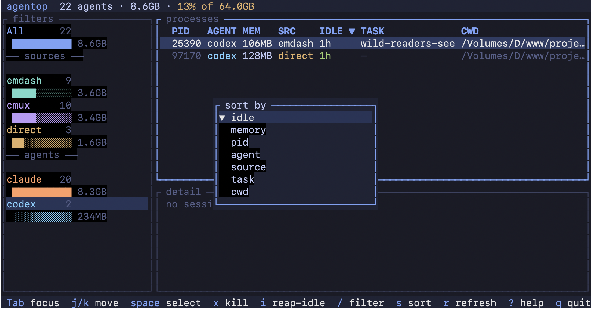
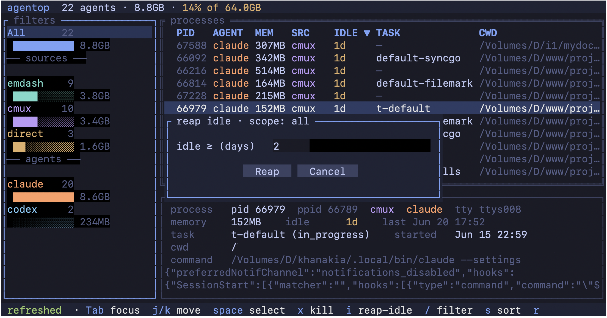
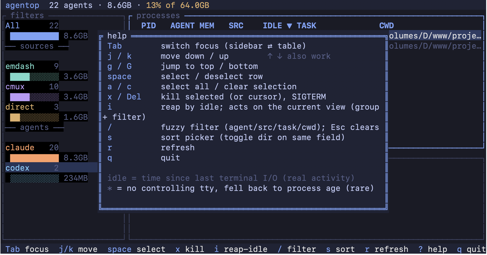

<p align="center">
  
</p>

# agentop

**htop for AI coding agents.** It finds every running Claude Code and OpenAI Codex session across cmux, emdash, and plain terminals. For each one you see how much memory it holds, how long it has been idle, and which task it belongs to. Then you kill the idle ones and get your RAM back. The agent's conversation is preserved; only the process dies.

## Why I built this

Run a few AI coding agents in parallel and you learn a quiet truth: they never leave. Every emdash worktree and every cmux pane spawns a Claude Code process holding 100 MB to over 1 GB of memory, and when you walk away it just stays. Idle. For days.

Stack up a busy week and one afternoon you look up to find twenty-plus forgotten sessions quietly eating 5 to 10 GB, the fans spinning, a 64 GB machine crawling, and no obvious culprit. Activity Monitor is no help: every session hides behind the same opaque version string (`2.1.183`), so you can't tell which is which, how stale it is, or which is safe to kill.

Here's the kicker: they're all safe to kill. A Claude session keeps its history on disk, so you can end the process, take the memory back, and pick up exactly where you left off. The part you care about was never in RAM.

The tools just won't let you do the simple thing:

- **emdash has no "end process" button.** The only way to free a session is to delete the entire task, worktree and all. I didn't want to throw away the work. I wanted the process gone. And emdash restores the session by id the moment you reopen the task, so ending it is exactly right: free it now, get it back later.
- **cmux** stacks up the same way, with no quick read on which panes are actually idle.

So I built `agentop`: one fast view of every agent across every tool, and the one move I actually wanted. Kill the idle, keep the work.

## What it does

- **Discovers** every running agent session across cmux, emdash, and plain terminals by inspecting the process tree. No integration, no setup.
- **Shows** memory, real idle time, agent, source, and the owning task for each one, in a live `htop`-style dashboard.
- **Filters** by source or agent in the sidebar (with per-group memory bars), and by a fuzzy search across the text columns.
- **Reaps** the idle ones, either select-and-kill in the TUI or `agentop reap --idle 2` from the shell. It uses `SIGTERM` (graceful) and a confirmation that shows exactly what dies and how much you reclaim.

Killing frees only the process. emdash restores the conversation when you reopen the task, and cmux and Claude resume from disk. You lose memory pressure, not work.

## Screenshots

<p align="center">
  
</p>

| | |
|:--:|:--:|
| <br>**Filter by agent or source** | <br>**Sort by any column** |
| <br>**Reap idle sessions in one pass** | <br>**Full keymap (`?`)** |

## Supported agents and sources

agentop works with **Claude Code** and **OpenAI Codex** today, and more agents can be added. It groups each session by the controller that launched it:

- **emdash**: tasks running in [emdash](https://github.com/generalaction/emdash) git worktrees
- **cmux**: sessions in [cmux](https://github.com/) terminal panes
- **direct**: agents started straight from a normal terminal (iTerm, Ghostty, tmux, VS Code)

## Install

### Homebrew

```bash
brew install thesatellite-ai/tap/agentop
```

### Install script (macOS or Linux)

```bash
curl -sL https://raw.githubusercontent.com/thesatellite-ai/agentop/main/install.sh | sh
```

### Go

```bash
go install github.com/thesatellite-ai/agentop@latest
```

### From source

```bash
git clone https://github.com/thesatellite-ai/agentop
cd agentop
task build      # builds ./bin/agentop  (or: go build -o bin/agentop .)
```

Requires macOS or Linux, and uses the system `ps` and `lsof`. The binary is a single static file (pure-Go SQLite, `CGO_ENABLED=0`) with no runtime dependencies.

## Usage

```bash
agentop                              # interactive TUI (default)
agentop list                         # one-shot table to stdout
agentop list --json                  # machine-readable JSON
agentop reap --idle 2                # kill any session idle >= 2 days (asks first)
agentop reap --idle 2 --source cmux  # restrict to one source (emdash|cmux|direct)
agentop reap --idle 7 --yes          # skip the confirmation prompt
agentop version                      # print version
```

### The TUI

A master-detail dashboard. The **sidebar** filters by two independent axes, source (emdash, cmux, direct) and agent (claude, codex), each with live counts and memory bars. The **table** shows the selected filter and sorts by any column. The **detail pane** follows the cursor with full process info.

| Key | Action |
|---|---|
| `Tab` | switch focus (sidebar and table) |
| `↑/↓`, `j/k` | move cursor |
| `g` / `G` | jump to top / bottom |
| `space` | select or deselect a row |
| `a` / `c` | select all in view / clear selection |
| `x`, `Del` | kill selected (or the cursor row), with confirmation |
| `i` | reap by idle threshold (see scope below) |
| `/` | fuzzy filter across agent, src, task, cwd (live; `Esc` clears) |
| `s` | sort picker (pick a field; press again to flip direction) |
| `r` | refresh |
| `?` | help overlay |
| `q` | quit |

### What reap acts on (scope)

The three kill paths scope differently. This matters, so it is worth being explicit.

| Action | What it kills |
|---|---|
| **TUI `i`** (reap by idle) | the **current view**: the active sidebar filter plus the active `/` quick-filter, narrowed to sessions idle past the threshold you enter |
| **TUI `x`** (kill) | the rows you **selected** with `space`, or the cursor row if none are selected |
| **CLI `agentop reap --idle N`** | **all sources** by default, since the CLI has no sidebar; narrow it with `--source emdash\|cmux\|direct` |

So in the TUI, reap follows what you are looking at. If the **emdash** group is selected, `i` reaps **only emdash** sessions and leaves cmux and direct untouched. Add a `/sync` filter on top and `i` reaps only the emdash sessions whose agent, source, task, or cwd matches "sync". The reap dialog's title shows the live scope (for example `reap idle · scope: emdash · /sync`), and the confirmation always lists the exact count and the RAM to be reclaimed before anything dies.

### Safe by design

- **SIGTERM first**, so the agent shuts down gracefully and flushes its state. Only a session that ignores SIGTERM and is still alive after a short grace period is escalated to SIGKILL — a kill should not silently no-op.
- **A confirmation gate** on every kill shows the count and the RAM you will reclaim.
- **Read-only until you act.** Discovery never touches anything; the only write is the signal you ask for.

## How idle works

Idle is the time since the session's terminal last did anything (the same signal the classic `w` command uses). It reflects real activity for every agent and source, accurate to the second. A session with no terminal output for days is genuinely idle; one that is actively working never shows as idle.

In the rare case where a session has no terminal to read from, idle falls back to the process age and is marked with a `*` (for example `5d*`) so you know it is an estimate.

## Platform support

macOS and Linux. agentop introspects processes with `ps` and `lsof`, ends them with `SIGTERM` (both Unix-only), and reads terminal device timestamps through OS-specific syscalls. Windows uses a different console model and is out of scope.

## Branding

Logo, icon, and the full color palette: [docs/BRANDING.md](docs/BRANDING.md). Assets live in [`assets/`](assets/).

## Contributing

See [CONTRIBUTING.md](CONTRIBUTING.md). In short: `gofmt` clean, `go vet ./...` clean, `go test ./...` passes, Conventional Commits, and no AI-attribution trailers.

## License

[Apache License 2.0](LICENSE).
